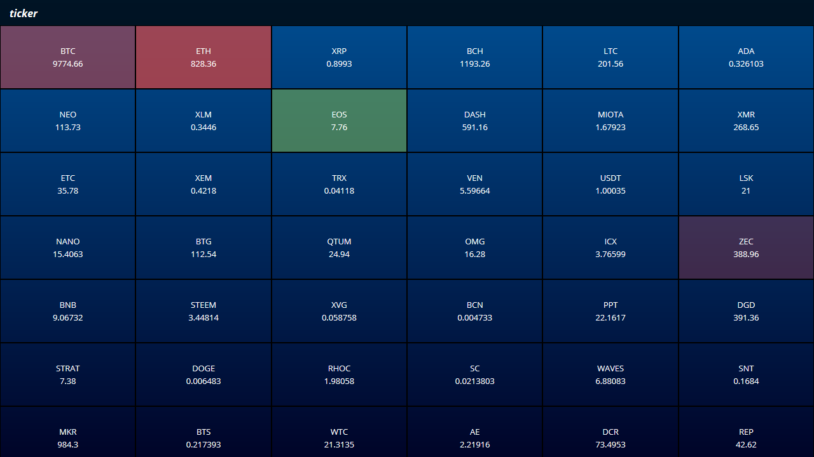

<h1>TICKER - Real time cryptotransactions ticker</h1>

<h3>Live demo: <a href="https://adrianiskander.github.io/ticker">adrianiskander.github.io/ticker</a></h3>

<h3>Requirements:</h3>
<ul>
  <li><a href="https://git-scm.com">Git</a> and <a href="https://nodejs.org">Node</a> installed</li>
  <li>No API keys required</li>
</ul>

<h3>Local deployment:</h3>
<ol>
  <li>Enter command line</li>
  <li>Clone repository: <code>git clone https://github.com/adrianiskander/ticker.git</code></li>
  <li>Enter repository: <code>cd ticker</code></li>
  <li>Install packages: <code>npm install</code></li>
  <li>Run with: <code>npm start</code></li>
  <li>Browse: <code>http://127.0.0.1:3000</code></li>
  <li>Stop with: <code>CTRL+C</code></li>
</ol>

<h3>Credits:</h3>

This application uses <a href="https://coinmarketcap.com/api/">CoinMarketCap API</a> and <a href="https://www.cryptocompare.com/api">CryptoCompare WebSocket API</a>. Thanks!

<h3>Licence: MIT</h3>
