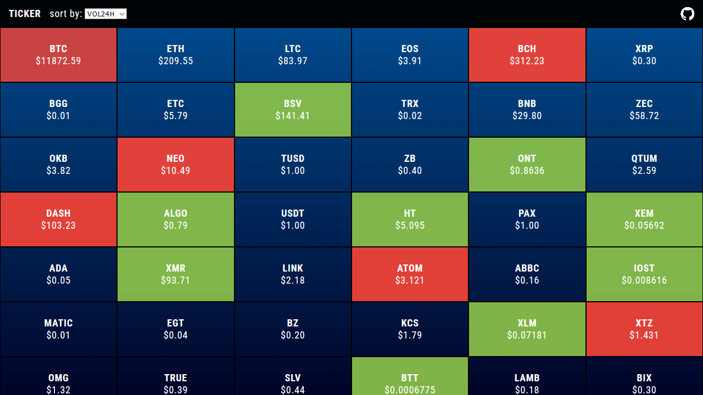

<h1>ticker / realtime cryptocurrency transactions / ticker</h1>

<h3>Check live demo: <a href="https://adrianiskander.github.io/ticker">adrianiskander.github.io/ticker</a></h3>

 
<h3>UPDATE: No deployment needed anymore, app is pure client-side now. Either git clone or download zip on any device with browser & internet and open index.html. Or just use live demo. Obsolete code will be removed on next iteration.</h3>

<h3>Made with</h3>
<ul>
  <li><a href="https://min-api.cryptocompare.com">CryptoCompare API</a></li>
  <li><a href="https://socket.io/">SocketIO</a></li>
  <li><a href="https://vuejs.org/">VueJS</a></li>
</ul>

<h3>Licence: MIT</h3>
